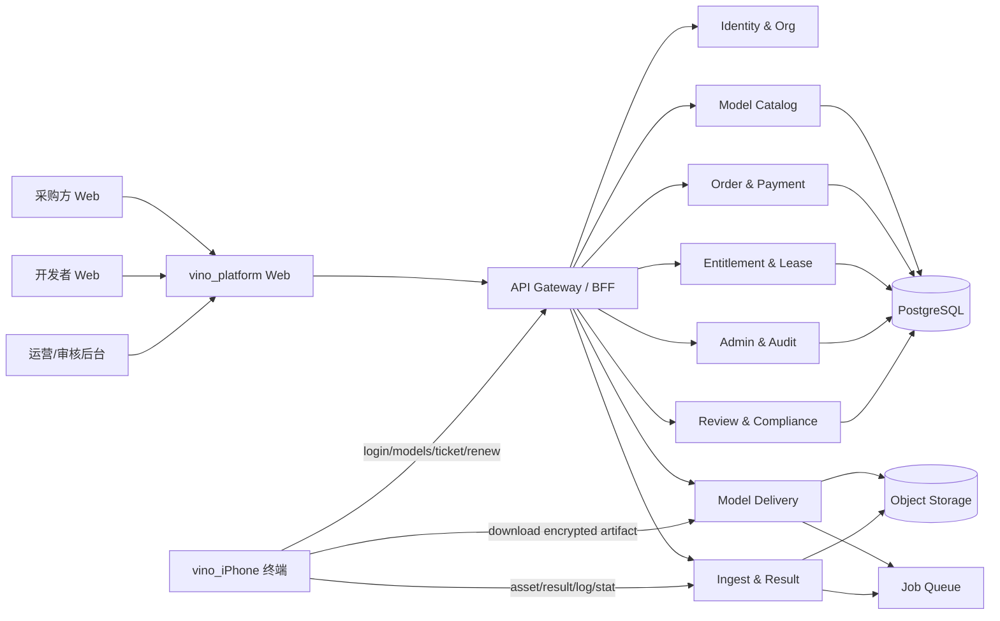

# vino_platform Architecture RFC

- Title: `vino_platform` 模型交易、授权与分发平台架构
- Owner: Vino
- Date: 2026-04-29
- Status: Draft

## Context

现有 `vino_cloud` 已跑通最小链路：

- 账号登录。
- 用户、模型、Entitlement 管理。
- iPhone 拉取授权模型。
- 申请下载票据。
- 生成 `vino-aesgcm-v1` 加密包。
- iPhone 解密、校验、安装。
- 离线租约续期。
- 媒体、结果、日志、统计 ingest。

`vino_platform` 要在这条链路上补齐交易平台能力，并把 MVP 文件状态升级为可生产运行的数据库、对象存储、队列和后台系统。

## Goals

- 支持采购方、开发者、平台运营、财务和审核员多角色协作。
- 支持模型从上传、审核、上架、售卖、授权、下载、续租到审计的闭环。
- 兼容 `vino_iPhone` 当前终端接口语义。
- 模型下载必须短时授权、设备绑定、哈希校验、可撤销。
- 交易、授权、文件、设备和审计解耦，便于后续扩展支付、结算和私有化。

## Non-goals

- 不在本轮改造 `vino_iPhone`。
- 不把平台做成消费级 App 内商城。
- P0 不要求自动分账、复杂推荐、在线训练和跨端通用模型运行时。

## Proposed Architecture

## 服务模块

| 模块 | 职责 | P0 |
| --- | --- | --- |
| Identity & Org | 用户、组织、角色、会话、SSO 预留 | Yes |
| Developer Profile | 开发者资质、店铺、协议 | Yes |
| Model Catalog | 模型、版本、构建、SKU、分类、标签 | Yes |
| Review & Compliance | 模型审核、版权材料、违规处理 | Yes |
| Commerce | 订单、支付状态、退款、优惠 | Partial |
| Entitlement & Lease | 授权、设备绑定、离线租约、撤销 | Yes |
| Model Delivery | 下载票据、加密包、对象存储、哈希 | Yes |
| Ingest & Result | 图片、视频、推理结果、日志、统计 | Partial |
| Settlement & Invoice | 开发者结算、提现、发票 | P1 |
| Notification | 站内信、邮件、短信、Webhook | P1 |
| Admin & Audit | 后台配置、操作日志、风控告警 | Yes |

## 关键链路

### 模型上传与构建

1. 开发者上传 `.mlmodel`、`.mlpackage` 或 `.mlmodelc`。
2. 平台写入对象存储临时区。
3. 后台任务计算 `sha256`、大小、格式、基础元数据。
4. 生成 `ModelBuild`，状态为 `uploaded`。
5. 审核通过后，构建可绑定到 `ModelSKU` 并上架。

### 订单到授权

1. 采购方创建 `Order`。
2. P0 支持平台运营手动确认收款；P1 接入在线支付回调。
3. 支付成功后创建 `Entitlement`。
4. Entitlement 可分配给组织、用户、设备或站点。
5. 所有分配、撤销、续期写入 `AuditLog`。

### iPhone 模型下载

沿用 `vino_cloud` 的成功路径：

1. `POST /auth/login`：终端提交账号、密码、设备 ID。
2. `GET /models`：平台返回当前会话可用模型和授权信息。
3. `POST /models/{modelId}/download-ticket`：平台校验 Entitlement 和设备绑定。
4. 平台生成短时 `DownloadTicket`，并更新或创建 `OfflineLease`。
5. `GET /download/{ticketId}`：平台返回模型加密包。
6. 终端按 `ticketSecret:modelId:deviceId:modelBuildId` 派生密钥，解密、校验哈希、安装。

### ingest 数据回传

1. `vino_iPhone` 上传图片、视频、推理结果、日志或统计。
2. 平台按 `idempotencyKey` 去重。
3. 原始资产进入对象存储，元数据进入数据库。
4. P1 可接本地 Web 节点，断网时本地缓存，联网后补传。

## 存储设计

| 存储 | 用途 |
| --- | --- |
| PostgreSQL | 账号、模型、订单、授权、设备、审计、结算 |
| Object Storage | 模型文件、加密产物、图片、视频、附件 |
| Redis | 会话缓存、下载票据缓存、限流、短时锁 |
| Queue | 模型扫描、病毒/格式检查、邮件、结算、转码 |
| Local Disk | 仅开发环境或本地节点缓存 |

## Interfaces

| Boundary | Contract | Failure Mode | Test |
| --- | --- | --- | --- |
| Web -> API | JSON REST, Bearer token, RBAC | 401/403/422 | API integration |
| iPhone -> Platform | 兼容 `vino_cloud` 登录、模型、票据、续租 | 未授权、租约过期、设备不匹配 | End-to-end |
| API -> Object Storage | Signed internal access, checksum | 上传中断、哈希不匹配 | Storage integration |
| Payment -> Commerce | Webhook + idempotency key | 重复回调、金额不一致 | Webhook replay |
| Queue -> Workers | Job ID + retry policy | 重试风暴、死信 | Worker tests |
| Local Node -> Cloud | Ingest API + idempotency | 断网、重复补传 | Offline replay |

## Quality Attributes

| Attribute | Target | Measurement |
| --- | --- | --- |
| Security | 未授权模型不可见、不可下载、不可续租 | 权限测试和审计 |
| Reliability | P0 单模型下载成功率 >= 95% | 下载任务统计 |
| Auditability | 关键动作 100% 记录操作人、对象、时间、IP | AuditLog 覆盖检查 |
| Maintainability | 交易、授权、下载服务边界清楚 | 模块级接口测试 |
| Performance | 模型列表 P95 < 500 ms；下载票据 P95 < 800 ms | APM |
| Recovery | 下载失败可重试，票据过期可重新申请 | 端到端失败恢复测试 |

## Trade-offs

| Option | Pros | Cons | Decision |
| --- | --- | --- | --- |
| 直接扩展 `vino_cloud` | 快，已有功能 | 零依赖原型不适合交易生产 | 仅作参考 |
| 新建 `vino_platform` | 可生产化，边界清晰 | 初期工程量更大 | 选择 |
| App 内商城 | 转化路径短 | 审核和支付风险高 | 不做 |
| Web 购买 + 终端授权 | B2B 合规叙事更稳 | 需要账号和后台 | 选择 |
| 永久离线 | 用户舒服 | 授权不可回收、盗版风险高 | 不做 |
| 长期许可证 + 短离线租约 | 可离线也可回收 | 需要续租服务 | 选择 |

## Rollout Plan

- Migration: 从 `vino_cloud/data/state.json` 抽象出正式 schema，再迁移模型发现、下载票据、加密包逻辑。
- Feature flag: 先按组织开启 `platform_delivery_v1`，保留 `vino_cloud` 演示环境。
- Observability: 记录登录、模型列表、票据、下载、续租、哈希失败、设备不匹配。
- Rollback: 下载服务故障时保留旧票据逻辑，订单和授权写入必须可回放。

## 下一步

先实现 Identity、Model Catalog、Entitlement、Delivery 四个 P0 服务，再补订单和运营后台。
