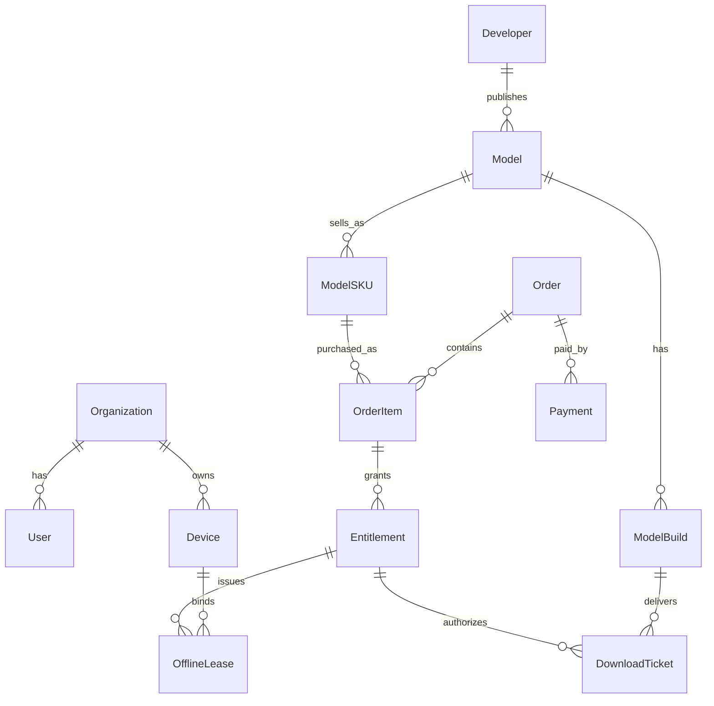

# vino_platform 数据模型

- Product: `vino_platform`
- Date: 2026-04-29
- Status: Draft

## 建模原则

- 交易对象和授权对象分离：订单证明“买了”，Entitlement 证明“谁能用”。
- 模型元数据和模型构建分离：`Model` 是商品语义，`ModelBuild` 是具体文件版本。
- 授权和离线租约分离：Entitlement 是长期权利，OfflineLease 是终端短周期运行凭证。
- 文件和业务记录分离：模型、图片、视频进对象存储，数据库保存元数据和哈希。
- 所有关键状态变化写入 `AuditLog`。

## 核心关系

## 账号与组织

### Organization

| Field | Type | Notes |
| --- | --- | --- |
| id | uuid | 组织 ID |
| name | string | 企业或项目组织名 |
| type | enum | buyer, developer_company, internal |
| status | enum | active, suspended, archived |
| billing_profile_id | uuid | 开票和付款信息 |
| created_at / updated_at | timestamp |  |

### User

| Field | Type | Notes |
| --- | --- | --- |
| id | uuid | 用户 ID |
| organization_id | uuid | 所属组织 |
| email / phone | string | 登录标识 |
| password_hash | string | P0 可先密码登录 |
| display_name | string |  |
| role | enum | owner, admin, operator, developer, reviewer, finance |
| status | enum | active, invited, disabled |
| last_login_at | timestamp |  |

### Device

| Field | Type | Notes |
| --- | --- | --- |
| id | uuid | 平台设备 ID |
| organization_id | uuid | 所属组织 |
| device_binding_id | string | iPhone 当前使用 `identifierForVendor` 或后续安全设备 ID |
| name | string | 设备名 |
| platform | string | iOS |
| status | enum | active, lost, retired, blocked |
| last_seen_at | timestamp |  |

## 开发者与店铺

### Developer

| Field | Type | Notes |
| --- | --- | --- |
| id | uuid | 开发者 ID |
| organization_id | uuid | 个人可创建个人组织 |
| display_name | string | 对外展示名 |
| type | enum | individual, team, company |
| verification_status | enum | draft, submitted, approved, rejected |
| settlement_account_id | uuid | P1 结算账户 |
| agreement_signed_at | timestamp | 入驻协议 |

### DeveloperQualification

| Field | Type | Notes |
| --- | --- | --- |
| id | uuid |  |
| developer_id | uuid |  |
| kind | enum | identity, business_license, algorithm_proof, copyright |
| file_asset_id | uuid | 附件 |
| status | enum | pending, approved, rejected |
| reviewer_id | uuid |  |
| review_note | text |  |

## 模型与商品

### Model

| Field | Type | Notes |
| --- | --- | --- |
| id | uuid | 模型 ID |
| developer_id | uuid | 发布者 |
| name | string | 模型名 |
| slug | string | URL 标识 |
| category | string | cv, speech, llm, vertical |
| scenario_tags | string[] | 行业和场景 |
| summary | text | 简述 |
| description | text | 详情 |
| status | enum | draft, in_review, approved, listed, delisted, banned |
| current_build_id | uuid | 当前默认构建 |

### ModelBuild

| Field | Type | Notes |
| --- | --- | --- |
| id | uuid | 构建 ID |
| model_id | uuid |  |
| version | string | 语义版本或内部版本 |
| build_number | string | 构建号 |
| platform | enum | ios, macos, api |
| source_format | enum | mlmodel, mlpackage, mlmodelc, api |
| transport_format | enum | bundle_archive, raw_file, api_endpoint |
| object_key | string | 对象存储路径 |
| sha256 | string | 明文包哈希 |
| byte_count | bigint | 文件大小 |
| encryption_required | bool | 默认 true |
| status | enum | uploaded, scanning, ready, rejected, retired |

### ModelSKU

| Field | Type | Notes |
| --- | --- | --- |
| id | uuid | SKU ID |
| model_id | uuid |  |
| build_id | uuid | 可为空，表示跟随 current_build |
| name | string | 标准版、企业版、试用版 |
| license_type | enum | trial, subscription, perpetual, project |
| price_amount | decimal | 价格 |
| currency | string | CNY/USD |
| duration_days | int | 限时授权 |
| max_devices | int | 设备数 |
| offline_lease_days | int | 离线租约天数 |
| status | enum | active, inactive |

## 交易

### Order

| Field | Type | Notes |
| --- | --- | --- |
| id | uuid | 订单 ID |
| buyer_organization_id | uuid | 采购组织 |
| buyer_user_id | uuid | 下单人 |
| status | enum | draft, pending_payment, paid, delivering, completed, canceled, refunded, after_sale |
| total_amount | decimal | 总金额 |
| currency | string |  |
| payment_mode | enum | online, offline_transfer, balance |
| created_at / paid_at / completed_at | timestamp |  |

### OrderItem

| Field | Type | Notes |
| --- | --- | --- |
| id | uuid |  |
| order_id | uuid |  |
| model_sku_id | uuid |  |
| model_id | uuid | 冗余快照 |
| quantity | int |  |
| unit_price | decimal | 下单时价格 |
| entitlement_policy_snapshot | jsonb | 授权策略快照 |

### Payment

| Field | Type | Notes |
| --- | --- | --- |
| id | uuid | 支付记录 |
| order_id | uuid |  |
| provider | enum | wechat, alipay, bank_transfer, manual |
| status | enum | pending, succeeded, failed, refunded |
| amount | decimal |  |
| provider_trade_no | string | 第三方流水 |
| idempotency_key | string | 防重复回调 |

## 授权与下载

### Entitlement

| Field | Type | Notes |
| --- | --- | --- |
| id | uuid | 授权 ID |
| source_order_item_id | uuid | 可为空，支持手工授权 |
| organization_id | uuid | 授权归属组织 |
| model_id | uuid |  |
| model_sku_id | uuid |  |
| assigned_to_type | enum | organization, user, device, site |
| assigned_to_id | uuid/string | 对应对象 |
| license_id | string | 对终端展示的许可证 ID |
| starts_at | timestamp |  |
| ends_at | timestamp nullable | 永久授权为空 |
| renewal_mode | enum | perpetual, fixed |
| offline_lease_days | int | 默认 7 到 30 |
| max_devices | int |  |
| policy_flags | string[] | offline, device_bound, trial |
| status | enum | active, suspended, expired, revoked |

### OfflineLease

| Field | Type | Notes |
| --- | --- | --- |
| id | uuid | 租约 ID |
| entitlement_id | uuid |  |
| device_id | uuid |  |
| model_build_id | uuid |  |
| lease_expires_at | timestamp nullable | 永久可为空，但建议仍设周期 |
| renewed_at | timestamp |  |
| policy_flags | string[] |  |
| status | enum | active, expired, revoked |

### DownloadTicket

| Field | Type | Notes |
| --- | --- | --- |
| id | uuid/string | 短时票据 |
| entitlement_id | uuid |  |
| user_id | uuid |  |
| device_id | uuid |  |
| model_id | uuid |  |
| model_build_id | uuid |  |
| expires_at | timestamp | 建议 15 分钟 |
| ticket_secret_hash | string | 不存明文 |
| sha256 | string | 明文包哈希 |
| byte_count | bigint |  |
| status | enum | issued, used, expired, revoked |

## 审核与安全

### ReviewCase

| Field | Type | Notes |
| --- | --- | --- |
| id | uuid | 审核单 |
| subject_type | enum | developer, model, model_build, complaint |
| subject_id | uuid |  |
| status | enum | pending, approved, rejected, escalated |
| reviewer_id | uuid |  |
| decision_note | text |  |

### AuditLog

| Field | Type | Notes |
| --- | --- | --- |
| id | uuid |  |
| actor_user_id | uuid nullable | 系统任务可为空 |
| actor_type | enum | user, system, webhook |
| action | string | model.approve, entitlement.revoke |
| object_type | string |  |
| object_id | string |  |
| ip_address | string |  |
| user_agent | string |  |
| payload | jsonb | 变更摘要 |
| created_at | timestamp |  |

## ingest

### IngestAsset

| Field | Type | Notes |
| --- | --- | --- |
| id | uuid |  |
| idempotency_key | string | 去重 |
| organization_id | uuid |  |
| device_id | uuid/string |  |
| file_name | string |  |
| category | enum | photo, video, binary |
| object_key | string |  |
| byte_count | bigint |  |
| product_uuid | string | 产线追踪字段 |
| point_index | int | 工位点位 |
| job_id | string | 任务 ID |
| captured_at | timestamp |  |

### IngestResult

| Field | Type | Notes |
| --- | --- | --- |
| id | uuid |  |
| idempotency_key | string | 去重 |
| organization_id | uuid |  |
| device_id | uuid/string |  |
| model_id | uuid nullable |  |
| model_build_id | uuid nullable |  |
| result_type | string | detection, classification |
| payload | jsonb | 推理输出 |
| product_uuid | string |  |
| point_index | int |  |
| captured_at | timestamp |  |

## `vino_cloud` 到 `vino_platform` 映射

| `vino_cloud` 字段/概念 | `vino_platform` 目标模型 |
| --- | --- |
| `users` | `User` + `Organization` |
| `models` | `Model` + `ModelBuild` |
| `entitlements` | `Entitlement` |
| `leases` | `OfflineLease` |
| `tickets` | `DownloadTicket` |
| `ingests.assets/results/logs/stats` | `IngestAsset`、`IngestResult`、`DeviceLog`、`DeviceStat` |
| `sourcePath` | `ModelBuild.object_key` 或开发环境文件路径 |
| `modelBuildId` | `ModelBuild.id` 或外部 build number |

## 索引建议

- `users(email)` unique。
- `devices(organization_id, device_binding_id)` unique。
- `models(developer_id, status)`。
- `model_builds(model_id, version, build_number)`。
- `orders(buyer_organization_id, status, created_at)`。
- `entitlements(organization_id, model_id, assigned_to_type, assigned_to_id)`。
- `download_tickets(id, expires_at)`。
- `audit_logs(object_type, object_id, created_at)`。
- `ingest_assets(organization_id, device_id, captured_at)`。
- `ingest_results(organization_id, product_uuid, point_index, captured_at)`。

## 下一步

把这些实体转成迁移脚本和 ORM schema，并先实现 `Organization`、`User`、`Model`、`ModelBuild`、`Entitlement`、`OfflineLease`、`DownloadTicket`。
