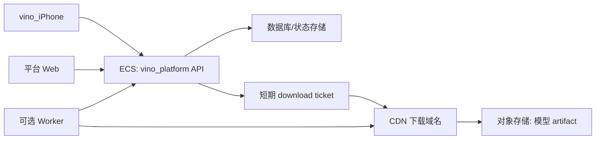

# Worker/CDN 拆分建议

## 结论

可以拆，但国内上线的默认方案不建议把主控制面直接放到 Cloudflare Worker。

推荐先拆成：

1. `vino_platform` 控制面：继续跑在阿里云 ECS / 容器内，负责账号、组织、设备绑定、授权、订单、审计、download ticket。
2. 模型文件面：迁到对象存储 + CDN，国内优先使用阿里云 OSS + CDN 或同等国内云服务。
3. Worker：可作为海外版轻量 API Gateway / signed URL 代理 / 边缘鉴权层，不直接处理模型大文件、不承担国内唯一控制面。

## 原因

Cloudflare Worker 适合轻量控制面，不适合把当前 Node 单体原样搬上去：

- 当前 `server.js` 有本地文件状态、模型 artifact 缓存、下载临时目录、维护脚本和后台页面，不符合 Worker 的无本地磁盘运行模型。
- Worker 有 128 MB isolate 内存限制，模型包不能在 Worker 内完整读入、加密、缓存。
- Worker 响应体没有强制大小上限，但 CDN 缓存体积仍有计划级限制；模型大文件应直接走对象存储/CDN。
- Worker 请求体大小由 Cloudflare 账号计划限制，Free/Pro 为 100 MB，Business 为 200 MB，Enterprise 默认 500 MB；开发者上传大模型不适合直接穿 Worker。
- Cloudflare China Network 是 Enterprise 额外订阅，并要求 ICP 等流程；国内 P0 上线不应默认依赖它。

参考：

- Cloudflare Worker limits: https://developers.cloudflare.com/workers/platform/limits/
- Cloudflare R2 public buckets/custom domains: https://developers.cloudflare.com/r2/buckets/public-buckets/
- Cloudflare China Network overview: https://developers.cloudflare.com/china-network/
- Cloudflare China Network get started: https://developers.cloudflare.com/china-network/get-started/

## 目标架构

## API 分工

保留在控制面：

- 登录、设备邀请、设备 claim。
- 模型清单。
- 订单、授权、租约、审计。
- 创建 download ticket。
- 生成对象存储/CDN 的短期签名 URL。

迁到文件面：

- 模型 artifact 原文件。
- 加密后的模型包。
- 大文件分片上传。
- CDN 缓存与回源。

可选放 Worker：

- 海外用户的 `/api/cloud/v1/*` 边缘转发。
- 验证 ticket 后 302 到 CDN signed URL。
- 轻量限频、CORS、请求头归一化。
- 不做模型加密、不落盘、不写主交易状态。

## 改造步骤

P0：当前实现继续保持 ECS 单容器可运行，先完成 iPhone 设备绑定和体验改造。

P1：把 `download-ticket` 返回从本机 `/api/cloud/v1/download/:ticketId` 扩展为可配置的外部 artifact URL。先兼容现有本机下载。

P2：引入对象存储字段：

- `artifactStorageProvider`
- `artifactBucket`
- `artifactKey`
- `artifactSha256`
- `artifactByteCount`
- `artifactCdnBaseURL`

P3：开发者上传模型后，后端把 artifact 推到对象存储；下载 ticket 只生成短期签名 URL。

P4：国内生产使用 ECS API + 国内 OSS/CDN；海外版再评估 Cloudflare Worker + R2/CDN。

## 当前判断

短期不要把整坨 `server.js` 直接拆到 Worker。正确拆法是先切文件面：模型 artifact 进对象存储/CDN，ECS 只保留控制面和签名授权。这样能最快降低 ECS 带宽和磁盘压力，也不影响国内访问稳定性。
